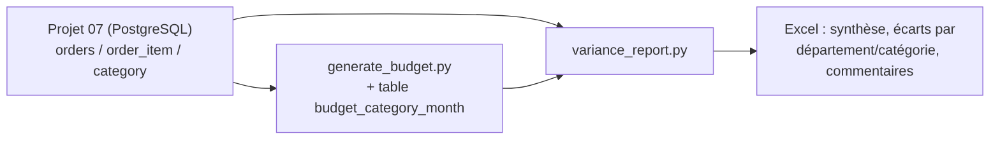

# Projet 15 — Reporting de gestion : écarts Budget vs Réel

[](https://github.com/valentinratigniet-byte/projet-15-reporting-ecarts-cg/actions/workflows/ci.yml)

> Le pack de clôture mensuelle d'un contrôleur de gestion : comparer le Réel au
> Budget, et **expliquer** l'écart plutôt que le constater. Un écart de CA
> global ne dit rien de ce qui s'est passé — a-t-on vendu moins, moins cher, ou
> pas les bonnes catégories ? Ce projet répond avec la méthode standard
> **Prix / Volume / Mix**, sur les 10 catégories et 40 000 commandes de la base
> du [Projet 07](https://github.com/valentinratigniet-byte/projet-07-base-ecommerce).

## 🎯 Problème métier

Un tableau "CA réel : 70,3 M€, Budget : 71,6 M€" ne permet aucune décision. Le
directeur commercial et le contrôleur de gestion ont besoin de savoir *pourquoi*
— volumes en retard, prix érodés par des promotions, ou glissement du mix vers
des catégories moins chères. Ce projet automatise cette décomposition et
génère un commentaire de clôture par département, comme un vrai reporting
mensuel.

## 🗂️ Architecture



Le **Réel** vient directement de la base du Projet 07 (réutilisée telle quelle,
même conteneur, port 5433). Le **Budget** est la seule donnée manquante : il
est généré par catégorie et par mois avec un biais de prévision réaliste et
reproductible (certaines catégories sur-budgétées, d'autres sous-budgétées),
sinon l'écart serait toujours nul.

Les 10 catégories du Projet 07 sont regroupées en 4 départements métier
(`src/variance_report.py`, dict `DEPARTMENTS`) : Tech & Loisirs numériques,
Maison & Quotidien, Mode & Bien-être, Culture.

## 📐 Méthode

Décomposition **Prix / Volume / Mix**, formules et preuve de l'identité
algébrique dans **[docs/methode.md](docs/methode.md)**. Les deux identités
(`Prix + Volume = Total` au niveau catégorie, `Prix + Volume + Mix = Total` au
niveau département) sont vérifiées par des `assert` dans le script — pas de
chiffre publié sans preuve qu'il boucle.

## 📊 Résultats mesurés (25 mois de données, mois en cours exclu)

| | Budget | Réel | Écart |
|---|---:|---:|---:|
| **Total** | 71 631 396 € | 70 256 494 € | **-1 374 902 € (-1,9 %)** |

| Département | Écart total | Facteur principal |
|---|---:|---|
| Mode & Bien-être | -1 503 202 € | Volume (-1 062 654 €) |
| Tech & Loisirs numériques | -1 073 983 € | Prix (-1 097 346 €) |
| Culture | +422 353 € | Prix (+306 150 €) |
| Maison & Quotidien | +779 929 € | Volume (+461 253 €) |

Deux départements compensent en partie les deux autres — invisible sur le seul
total consolidé, visible dès qu'on descend d'un niveau. C'est exactement ce
que doit produire un reporting de gestion.

## 🚀 Reproduire

Prérequis : la base du [Projet 07](https://github.com/valentinratigniet-byte/projet-07-base-ecommerce)
doit tourner (même conteneur Docker, port 5433) et être seedée.

```bash
# Depuis le Projet 07, si pas déjà lancé :
#   docker compose up -d && python seed/seed.py

pip install -r requirements.txt
docker exec -i p07_ecommerce_db psql -U portfolio -d ecommerce < sql/01_budget_schema.sql
python src/generate_budget.py     # génère le Budget (biais reproductible)
python src/variance_report.py     # calcule les écarts + génère l'Excel
```

Sortie : `output/reporting_ecarts_<AAAA-MM-JJ>.xlsx` (Synthèse, Écarts par
département, Écarts par catégorie, Commentaires) + le détail imprimé en
console. Exemple versionné : `output/exemple_reporting_ecarts.xlsx`.

## 🗃️ Structure du repo

```
projet-15-reporting-ecarts-cg/
├── README.md
├── sql/
│   └── 01_budget_schema.sql   ← table budget_category_month
├── src/
│   ├── generate_budget.py     ← génère le Budget (biais par catégorie, seedé)
│   └── variance_report.py     ← décomposition Prix/Volume/Mix + export Excel
├── docs/
│   └── methode.md             ← formules + preuve de l'identité algébrique
└── output/
    └── exemple_reporting_ecarts.xlsx
```

## 🧠 Choix de conception notables

- **Budget en base, pas en CSV** : `budget_category_month` vit dans la même
  base Postgres que le Réel — un vrai contrôleur de gestion compare deux
  sources dans le même entrepôt, pas un tableur à part.
- **Biais de prévision par catégorie, pas du bruit pur** : chaque catégorie a
  un biais fixe (seed = son id) plutôt qu'un écart aléatoire à chaque run —
  le rapport raconte la même histoire à chaque régénération, comme un vrai
  historique de prévisions.
- **Mois en cours exclu** : comparer un mois incomplet au budget du mois
  entier fausserait l'écart volume (déjà le piège rencontré sur le Projet 04
  avec l'API météo).
- **Identités vérifiées par `assert`**, pas juste espérées : un bug de
  décomposition produirait un chiffre faux silencieusement sinon — inacceptable
  sur un livrable financier.

---

*Projet 15 du [Portfolio Data](https://github.com/valentinratigniet-byte). Réutilise la base du
[Projet 07](https://github.com/valentinratigniet-byte/projet-07-base-ecommerce). Prochaine brique :
Projet 16 — business case d'investissement (NPV/IRR/sensibilité).*
